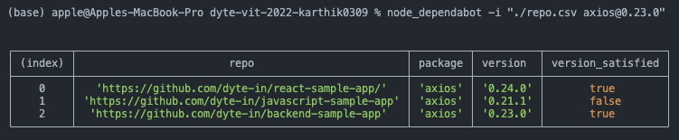
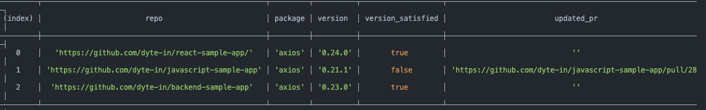

[](https://classroom.github.com/online_ide?assignment_repo_id=7947221&assignment_repo_type=AssignmentRepo)
<div id="top"></div>
<!--
*** Thanks for checking out the Best-README-Template. If you have a suggestion
*** that would make this better, please fork the repo and create a pull request
*** or simply open an issue with the tag "enhancement".
*** Don't forget to give the project a star!
*** Thanks again! Now go create something AMAZING! :D
-->


<!-- PROJECT SHIELDS -->
<!--
*** I'm using markdown "reference style" links for readability.
*** Reference links are enclosed in brackets [ ] instead of parentheses ( ).
*** See the bottom of this document for the declaration of the reference variables
*** for contributors-url, forks-url, etc. This is an optional, concise syntax you may use.
*** https://www.markdownguide.org/basic-syntax/#reference-style-links
-->
[![Contributors][contributors-shield]][contributors-url]
[![Forks][forks-shield]][forks-url]
[![Stargazers][stars-shield]][stars-url]
[![Issues][issues-shield]][issues-url]
[![MIT License][license-shield]][license-url]
[![LinkedIn][linkedin-shield]][linkedin-url]


<!-- PROJECT LOGO -->
<br />
<div align="center">
  <a href="https://github.com/github_username/repo_name">
    
  </a>

<h3 align="center">node_dependabot</h3>

  <p align="center">
    Updates dependencies at a time and creates a pull request with all the info you need
    <br />
    <a href="https://github.com/github_username/repo_name"><strong>Explore the docs »</strong></a>
    <br />
    <br />
    <a href="https://drive.google.com/file/d/1q75ZZx51xK2J3fKTyrKaL9yvPjBAT0ZI/view?usp=sharing">
      View Demo
    </a>
    ·
    <a href="https://github.com/github_username/repo_name/issues">Report Bug</a>
    ·
    <a href="https://github.com/github_username/repo_name/issues">Request Feature</a>
  </p>
</div>


<!-- TABLE OF CONTENTS -->
<details>
  <summary>Table of Contents</summary>
  <ol>
    <li>
      <a href="#about-the-project">About The Project</a>
      <ul>
        <li><a href="#built-with">Built With</a></li>
      </ul>
    </li>
    <li>
      <a href="#getting-started">Getting Started</a>
      <ul>
        <li><a href="#prerequisites">Prerequisites</a></li>
        <li><a href="#installation">Installation</a></li>
      </ul>
    </li>
    <li><a href="#usage">Usage</a></li>
    <li><a href="#roadmap">Roadmap</a></li>
    <li><a href="#contributing">Contributing</a></li>
    <li><a href="#license">License</a></li>
    <li><a href="#contact">Contact</a></li>
    <li><a href="#acknowledgments">Acknowledgments</a></li>
  </ol>
</details>


<!-- ABOUT THE PROJECT -->
## About The Project

[![Product Name Screen Shot][product-screenshot]]

Here's a blank template to get started: To avoid retyping too much info. Do a search and replace with your text editor for the following: `github_username`, `repo_name`, `twitter_handle`, `linkedin_username`, `email_client`, `email`, `project_title`, `project_description`

<p align="right">(<a href="#top">back to top</a>)</p>


### Built With

* [Node js]("https://nodejs.org/")
* [Yargs]("http://yargs.js.org/")
* [Octokit]("https://octokit.github.io/rest.js/v18)


<p align="right">(<a href="#top">back to top</a>)</p>


<!-- GETTING STARTED -->
## Getting Started

This is an example of how you may give instructions on setting up your project locally.
To get a local copy up and running follow these simple example steps.

### Prerequisites

This is an example of how to list things you need to use the software and how to install them.
* npm
  ```sh
  npm install npm@latest -g
  ```
* gh cli
  ```sh
    mac - brew install gh	
    linux - winget install --id GitHub.cli	
  ```
For more info refer [here](https://github.com/cli/cli)

### Installation

1. Clone the repo
   ```sh
   git clone https://github.com/dyte-submissions/dyte-vit-2022-karthik0309
   ```
2. Install NPM packages
   ```sh
   npm install
   ```
3. Run npm i -g .
   ```js
    npm i -g .
   ```
4. Go to the installed dir and give program executable permission to files
   ```js
    sudo chown -R $USER /usr/local/lib/node_modules
   ```
5. Create a .env file and add your gh private access token and git_url
   ```js
    GH_TOKEN="your_private_access_token"
    GH_URL="your_github_url"
   ```

6. To run the program(only to check package version)
   ```js
    node_dependabot -i "filepath package@version"

    eg: node_dependabot  -i "./repo.csv axios@0.23.0"
   ```
   - to lower version Update packages
   ```js
    node_dependabot -update -i "./repo.csv axios@0.23.0"
   ```

<p align="right">(<a href="#top">back to top</a>)</p>


<!-- USAGE EXAMPLES -->
## Usage

Use this space to show useful examples of how a project can be used. Additional screenshots, code examples and demos work well in this space. You may also link to more resources.

  To check if all repos of packages of spesified version:
  ```js
    node_dependabot  -i "./repo.csv axios@0.23.0"
  ```
  

  To update packages with lower version
  ```js
    node_dependabot -update -i "./repo.csv axios@0.23.0"
  ```
  

_For more examples, please refer to the [Documentation](https://example.com)_

<p align="right">(<a href="#top">back to top</a>)</p>


<!-- ROADMAP -->
## Roadmap

- [ ] know outdated packages
- [ ] update outdated packages
- [ ] creating a pull request of updated packages

See the [open issues](https://github.com/dyte-submissions/dyte-vit-2022-karthik0309/issues) for a full list of proposed features (and known issues).

<p align="right">(<a href="#top">back to top</a>)</p>


<!-- CONTRIBUTING -->
## Contributing

Contributions are what make the open source community such an amazing place to learn, inspire, and create. Any contributions you make are **greatly appreciated**.

If you have a suggestion that would make this better, please fork the repo and create a pull request. You can also simply open an issue with the tag "enhancement".
Don't forget to give the project a star! Thanks again!

1. Fork the Project
2. Create your Feature Branch (`git checkout -b feature/AmazingFeature`)
3. Commit your Changes (`git commit -m 'Add some AmazingFeature'`)
4. Push to the Branch (`git push origin feature/AmazingFeature`)
5. Open a Pull Request

<p align="right">(<a href="#top">back to top</a>)</p>


<!-- LICENSE -->
## License

Distributed under the MIT License. See `LICENSE.txt` for more information.

<p align="right">(<a href="#top">back to top</a>)</p>


<!-- CONTACT -->
## Contact

Karthik Belida - [@linkedin](https://www.linkedin.com/in/karthik-belida-5812a61b0/) - karthik392001@gmail.com

Project Link: [dyte-vit-2022-karthik0309](https://github.com/dyte-submissions/dyte-vit-2022-karthik0309)

<p align="right">(<a href="#top">back to top</a>)</p>


<!-- ACKNOWLEDGMENTS -->
## Acknowledgments

* []()
* []()
* []()

<p align="right">(<a href="#top">back to top</a>)</p>


<!-- MARKDOWN LINKS & IMAGES -->
<!-- https://www.markdownguide.org/basic-syntax/#reference-style-links -->
[contributors-shield]: https://img.shields.io/github/contributors/github_username/repo_name.svg?style=for-the-badge
[contributors-url]: https://github.com/dyte-submissions/dyte-vit-2022-karthik0309/graphs/contributors
[forks-shield]: https://img.shields.io/github/forks/github_username/repo_name.svg?style=for-the-badge
[forks-url]: https://github.com/dyte-submissions/dyte-vit-2022-karthik0309/network/members
[stars-shield]: https://img.shields.io/github/stars/github_username/repo_name.svg?style=for-the-badge
[stars-url]: https://github.com/dyte-submissions/dyte-vit-2022-karthik0309/stargazers
[issues-shield]: https://img.shields.io/github/issues/github_username/repo_name.svg?style=for-the-badge
[issues-url]: https://github.com/dyte-submissions/dyte-vit-2022-karthik0309/issues
[license-shield]: https://img.shields.io/github/license/github_username/repo_name.svg?style=for-the-badge
[license-url]: https://github.com/github_username/repo_name/blob/master/LICENSE.txt
[linkedin-shield]: https://img.shields.io/badge/-LinkedIn-black.svg?style=for-the-badge&logo=linkedin&colorB=555
[linkedin-url]: https://www.linkedin.com/in/karthik-belida-5812a61b0/
[product-screenshot]: images/version.png
[email]:karthik392001@gmail.com
[github_username]:karthik0309
 